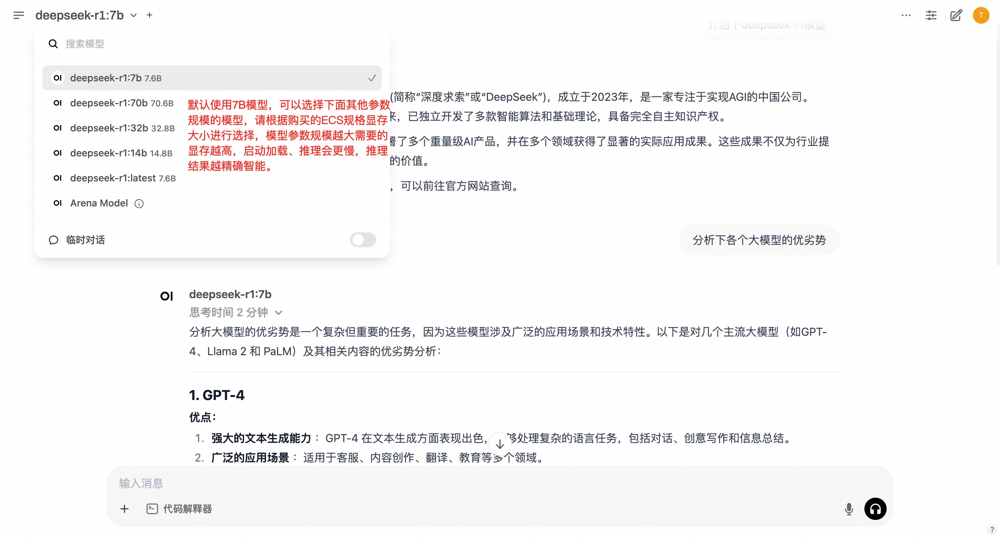

# DeepSeek社区版部署文档

## DeepSeek-R1简介
DeepSeek-R1是深度求索（DeepSeek）于2025年1月20日发布的开源人工智能大型语言模型。在数学、代码及推理任务上的表现与 OpenAI-o1 旗鼓相当。 DeepSeek-R1(7b)是 DeepSeek R1 的中端版本。其设计目标是将 DeepSeek R1 的强大推理能力转移到更小的模型中，以提高计算效率和部署灵活性。
## Open WebUI和Ollama简介

Open WebUI 是一个功能丰富且用户友好的自托管 Web 用户界面（WebUI），它被设计用于与大型语言模型（LLMs）进行交互，特别是那些由 Ollama 或与 OpenAI API 兼容的服务所支持的模型。

Ollama 是一个开源项目，其主要目标是简化大型语言模型（LLMs）的部署和运行流程，使得用户能够在本地机器或私有服务器上轻松运行这些模型。

Open WebUI和Ollama做了集成，可以轻松在web界面上管理大模型，本服务通过Ollama运行DeepSeek-R1模型，您可以在Open WebUI中直接选择DeepSeek-R1模型进行对话。

## 计费说明
DeepSeek社区版在阿里云上的费用主要涉及：
* 所选GPU云服务器的规格
* 磁盘容量
* 公网带宽
计费方式：按量付费（小时）或包年包月
预估费用在创建实例时可实时看到。


## RAM账号所需权限

| 权限策略名称                          | 备注                     |
|---------------------------------|------------------------|
| AliyunECSFullAccess             | 管理云服务器服务（ECS）的权限       |
| AliyunVPCFullAccess             | 管理专有网络（VPC）的权限         |
| AliyunROSFullAccess             | 管理资源编排服务（ROS）的权限       |
| AliyunComputeNestUserFullAccess | 管理计算巢服务（ComputeNest）的用户侧权限 |


## 部署流程

1. 单击[部署链接](https://market.aliyun.com/shop/confirm_order.html?spm=5176.product-detail.buy.btn&spmPre=&scm=&orderData=eyJvcmRlckRhdGEiOlt7ImNvbW1vZGl0eUNvZGUiOiJjbG91ZG1hcmtldCIsImRhdGEiOnsicHJvZHVjdF9jb2RlIjoiY21najAwMDY5NTIwIiwic2t1IjoiY21najAwMDY5NTIwLXByZXBheSIsImR1cmF0aW9uIjoiMTAwIiwicHJpY2luZ0N5Y2xlIjoiWWVhciIsInF1YW50aXR5IjoxLCJvcmRlclR5cGUiOiJidXkiLCJjaGFyZ2VUeXBlIjoiUFJFUEFZIiwicXVlcnlQcm9tb3Rpb24iOnRydWV9LCJjb21wb25lbnRzIjp7Im9yZGVyX251bSI6MSwib3JkX3RpbWUiOiIxMDA6WWVhciIsInBhY2thZ2VfdmVyc2lvbiI6Inl1bmNvZGU2MzUyMDAwMDAxIn19XSwiYWRkaXRpb25hbERhdGEiOnsibHNwTG9jYXRpb24iOiIiLCJjb21wdXRlTmVzdFR5cGUiOiJwcml2YXRlIiwiY29tcHV0ZU5lc3RTZXJ2aWNlSWQiOiJzZXJ2aWNlLTQxYWQ1ODQzOWI0YjRiZjhhZTczIiwiYmlnZGlwcGVyX3NvdXJjZSI6eyJhY3Rpb25Tb3VyY2UiOiJ4SmlVR2Z6VDciLCJhcGx1c19sb2dfaWQiOiI0ZmUzNmEzYWRLWWx6TyIsInNwbVByZSI6IiIsInNjbSI6IiJ9fX0=)，进入服务实例部署界面，根据界面提示填写参数，可以看到对应询价明细，确认参数后点击**下一步：确认订单**
    

2. 确认订单完成后同意服务协议并点击**立即创建**。

3. 等待部署完成后就可以开始使用服务，进入服务实例详情点击Address访问。
    

## 使用说明
### 公网OpenWebUI地址
1. 访问概览页的**公网OpenWebUI地址**，注册管理员账号并登录。
    

2. 登录成功后即可使用内置的DeepSeek-R1模型进行对话啦。
    

### 私网API地址
1. 在和服务器同一VPC内的ECS中访问概览页的**私网API地址**。访问示例如下：
    ```shell
    curl 私网API地址 -d '{
      "model": "deepseek-r1:latest",
      "prompt": "你是谁？"
    }'
    ```
2. 如果想通过公网访问API地址，需要打开安全组11434端口，然后访问公网API地址（把私网API地址中的私网IP替换为ECS的公网IP）。访问示例如下：
    ```shell
    curl  http://公网ip:11434/api/generate -d '{
      "model": "deepseek-r1:latest",
      "prompt": "你是谁？"
    }'
    ```
### 进阶教程

- 在管理员面板中添加其他用户
    

- 通过面板下载其他模型，支持的模型请查看ollama官网：https://ollama.ai/library
    
